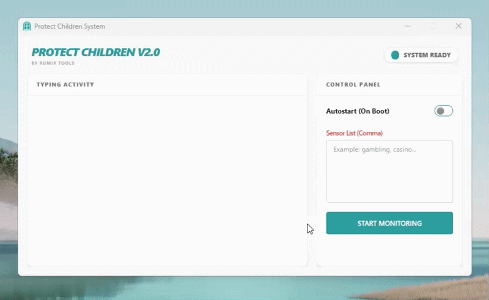

#  🛡️ PROTECT-CHILDREN
protect-children is a Windows-based desktop application specifically designed to help parents monitor their children's digital activities. This program focuses on monitoring text input in specific applications to ensure children's safety from inappropriate content.

## ✨ Key Features

* **Smart Keyword Detection**: Automatically detects sensitive words or adult content. Suspicious words will be highlighted in red in the log.

* **Stealth Mode**: Runs silently in the background without disturbing your child's activities.

* **Auto-Run**: Option to run the application automatically as soon as the computer is turned on.

## 🛠️ How to Compile (Build)
To allow others to try or develop this program, they need to follow these steps:

##  🎯 Requirements:

* **Install Go (latest version).**

* **Install Node.js & NPM.**

* **Install Wails CLI**: go install github.com/wailsapp/wails/v2/cmd/wails@latest.

## 📦Build Steps:

* **Clone repo**: ```git clone https://github.com/username/protect-children.git.```

* **Install Frontend**: Go to the ```frontend``` folder and run ```npm install```.

* **Compile**: In the root directory (the folder containing ```wails.json```), run the command: ```wails build```
* **Result**: A ready-to-use ```.exe``` file will appear in the ```build/bin/``` folder.

## 🖥️ System Compatibility
* **Windows 10 & 11:** Fully supported, requires Microsoft Edge WebView2 Runtime.
* **Windows 7 & 8:** Supported only if the user manually installs the Microsoft Edge WebView2 Runtime (Evergreen Bootstrapper).
* **Go Version:** Use Go 1.20 or lower for Windows 7 compatibility; Go 1.21+ does not officially support it.
* **Core Features:** Logging (Win32 API), Autostart (Registry), and Process Protection (Mutex) are natively compatible across all versions from Windows 7 to 11

# 🚀 How to Use
<p align="center">
  
</p>

## 1. Initialization
* When you first launch the application, it will automatically create a db folder in its directory to store configurations and activity logs.
* The system will check for existing configurations; if "Monitoring Active" was previously enabled, it will resume automatically.

## 2. Configuration & Monitoring
* **Sensor List:** Enter keywords or phrases you wish to monitor in the "Sensor List" text area, separated by commas (e.g., gambling, casino).
* **Start Monitoring:** Click the START MONITORING button to begin tracking keyboard activity.
* **Real-time Activity:** The "Typing Activity" box will display your keystrokes. Any word matching your Sensor List will be highlighted in red.
* **Function Keys:** Common system keys like [ENTER], [CTRL], or [BACKSPACE] will be highlighted in blue for better readability.

## 3. System Features
* **Autostart:** Enable the "Autostart (On Boot)" toggle to allow the program to run automatically when Windows starts.
* **Background Protection:** If you try to close the window while monitoring is active, the app will hide to the background instead of exiting to ensure continuous protection.
* **Single Instance:** The program is designed to run only one instance at a time to prevent system conflicts.

### ⚠️ Disclaimer: This program is created purely for educational purposes and legal parental supervision. Any misuse of this program to violate the privacy of others without permission is the responsibility of each user.
